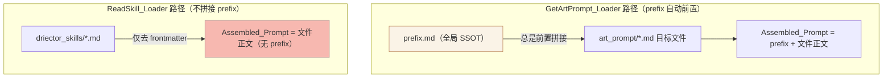
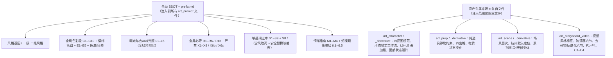
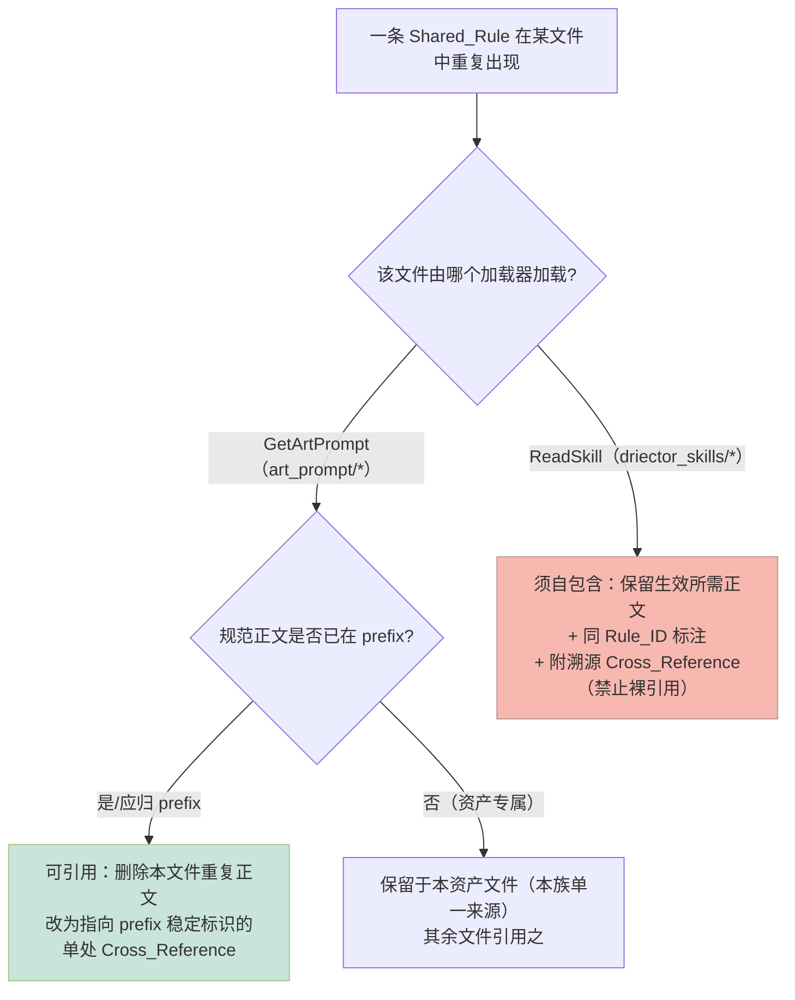

# Design Document

## Overview

（概述）

本设计描述「宠物拟人化Vlog（Pet Anthropomorphic Vlog）」美术技能库的**纯结构性/组织性重构**方案。重构目标是消除规则重复、建立单一事实来源（SSOT），同时严格保证生成行为等价（Behavioral_Equivalence）——重组规则归属，但不改变任意加载路径上 `Assembled_Prompt` 所携带的有效约束集合。

重构对象是 `data/skills/art_skills/pet_anthropomorphic_vlog/` 下的 12 个 Markdown 文件，不涉及任何应用代码逻辑变更。

### 决定整个设计的运行时事实（已逐行核对两个加载器）

| 加载器 | 源码位置 | 注入语义 | 设计含义 |
|---|---|---|---|
| **GetArtPrompt_Loader** | `src/utils/getArtPrompt.ts` → `getArtPrompt()` | 递归查找 `prefix.md` 并**总是前置拼接**到目标文件正文之前（`prefixContent + "\n" + fileContent`） | `prefix.md` 已是所有 `Art_Prompt_File` 的事实共享基底。`Art_Prompt_File` 中**已被 prefix 覆盖的全局规则可安全删正文、改为引用**，运行时仍由 prefix 注入。 |
| **ReadSkill_Loader** | `src/routes/production/storyboard/regeneratePrompt.ts` → `readSkill()` | 仅读取单文件、`stripFrontmatter()` 去除 frontmatter，**不拼接 prefix.md** | `Director_Skill_File` 加载时不含 prefix。其依赖的规则**必须在文件内自包含正文**，否则规则在生成时静默丢失。**裸引用 = 规则丢失**。 |

> 关键结论：**SSOT 的物理归属位置会改变规则的注入范围。** `prefix.md` 会被注入到**每一个** `Art_Prompt_File`。因此把一条规则迁入 `prefix.md`，等于把它注入到全部 7 个美术提示词文件。这条事实是后文「SSOT 分层」决策的根本依据。

### 设计核心原则

1. **注入范围守恒（Injection-Scope Preservation）**：把规则迁入 SSOT 不得扩大其原有注入范围。仅当某规则在重构前已对全部 `Art_Prompt_File` 生效（即已在 `prefix.md` 中，或语义上对所有美术文件成立）时，其规范正文才归入 `prefix.md`。资产专属规则（角色/道具/场景/视频专属）按需求 2.4 归于**对应文件**，其文件本身即该族的单一来源。
2. **按加载器决定引用策略**：经 `GetArtPrompt_Loader` 加载者「可引用」；经 `ReadSkill_Loader` 加载者「须自包含」。
3. **标识稳定 + 全库唯一**：保留既有 Rule_ID 文本逐字符不变，并以「文件限定」形式获得全库唯一可定位标识。
4. **冲突不自动收敛**：发现数值/措辞冲突时记入冲突清单、暂缓收敛，交维护者裁定。
5. **可验证完整性**：以 Rule_ID 为主键，建立重构前后双向一一对应清单，证明零丢失、零新增。

### 关于属性化测试（PBT）的适用性

本特性是对**静态 Markdown 内容**的结构性重构，不存在「对大输入空间成立的纯函数」：两个加载器是既有且不改动的代码，被加载的文件集合是**固定的 12 个**，每条加载路径的输出是确定性的。校验本质是对固定文件集合与两条加载路径产物的**确定性审计**（集合相等、引用可解析、正则扫描、清单双射），属于「配置/内容校验」范畴。因此本设计**不采用属性化测试、不设 Correctness Properties 章节**，改以确定性审计脚本 + 示例校验完成验证（详见 Testing Strategy）。

---

## Architecture

（架构）

### 1. 加载器与注入语义（重构安全边界）



- 左路径：`Art_Prompt_File` 中删去 prefix 已覆盖的全局规则正文不损失约束（prefix 运行时补回）。
- 右路径：`Director_Skill_File` 不享有 prefix 注入，**自包含是其约束生效的前提**。

### 2. SSOT 分层模型（注入范围守恒）

由于 `prefix.md` 注入范围 = 全部 `Art_Prompt_File`，SSOT 不是单一文件，而是「全局 SSOT + 资产专属来源」的分层：



**判定规则**：
- 一条规则在重构前**已对所有美术文件生效**（已在 prefix，或属风格基因/色彩/过审等全局约束）→ 规范正文归 `prefix.md`。
- 一条规则仅对**某一资产类型**生效（如「防漂移」「去AI味反退化」只对视频生成、「纯道具静物」只对道具）→ 规范正文归**该资产文件**，该文件即此族的单一来源；不得迁入 `prefix.md`（否则注入到无关美术文件 = 新增约束 = 违反 Behavioral_Equivalence）。

> 这一分层直接回应了需求 1.4 与需求 3 之间的张力：需求 1.4 要求「防漂移、去AI味/反退化」收敛为单一来源，需求 3 要求注入路径上约束等价。二者的协调结论是：**这两族的「单一来源」= `art_storyboard_video.md`（视频资产文件），而非 `prefix.md`**——既满足「全库只有一份规范正文」，又不扩大注入范围（见 Error Handling「设计级冲突 D-0」）。

### 3. 引用策略决策树（按加载器）



### 4. 受保护命名与代码契约（不可破坏）

应用代码以固定路径/文件名读取技能文件，重构**全部保持不变**：

- 基准目录：`skills/art_skills/pet_anthropomorphic_vlog/`
- 子目录名：`art_prompt/`、**`driector_skills/`（拼写错误，按需求 8 明确「超出本次重构范围，不重命名」）**
- `prefix.md`、`README.md`
- `art_prompt/` 7 个文件名、`driector_skills/` 3 个文件名

`readSkill("art_skills", project.artStyle, "driector_skills", "director_storyboard.md")` 硬编码了 `driector_skills` 与文件名；`getArtPrompt` 以 `findFileRecursive(baseDir, "prefix.md")` 与目标文件名定位。任一重命名都会断链，故一律冻结命名。

---

## Components and Interfaces

（组件与接口）

这里的「组件」指重构后各文件承担的职责与它们之间的引用契约。

### 1. prefix.md —— 全局 SSOT 的规范结构

重构后 `prefix.md` 是唯一承载**全局规范性约束**的文件，其章节即「稳定锚点」。每个全局 Rule_ID 在此恰有一份规范正文：

| 章节（锚点） | 承载的全局规范定义 | 稳定标识 |
|---|---|---|
| 一、风格基因 | 一级/二级风格、情感基调、质感锚词、核心定位 | `prefix.md#一-风格基因` |
| 二、全局色彩盘 | 色彩使用层级、C1–C10 色值表、硬/软约束色、情绪色盘、E1–E5、色温约束、曝光与去AI味光照 L1–L5、容差与例外 | `prefix.md#C1`…`#C10`、`#E1`…`#E5`、`#L1`…`#L5`（曝光层） |
| 三、全局约束规则 | 必守 R1–R6、R4b；严禁 X1–X8、X6b、X6c | `prefix.md#R1`…、`#R4b`、`#X1`…、`#X6b`、`#X6c`、`#X8` |
| 四、敏感词规避 | 风险词→安全替换映射表（逐行保留）、S1–S9、S8.1 | `prefix.md#S1`…`#S9`、`#S8.1` |
| 五、情绪扩展维度 | M1–M4 | `prefix.md#M1`…`#M4` |
| 六、短视频内容策略层 | 6.1 标题/6.2 标签/6.3 时长分档/6.4 镜头视角分层/6.5 首帧封面 | `prefix.md#6.1`…`#6.5` |

> 设计约束：`prefix.md` 现有章节顺序与 Rule_ID 文本保持不变；本次重构对 prefix 主要是**接收**从 `Art_Prompt_File` 上移的全局规则的「规范地位」（多数已在 prefix，故 prefix 改动最小），以及消解其内部 ID 冲突（见下「色彩层级 L1–L3」与「曝光层 L1–L5」同名问题，Error Handling D-1）。

### 2. 各文件引用策略矩阵（按加载器 + 注入范围）

| 文件 | 加载器 | 引用策略 | 重构动作 |
|---|---|---|---|
| `README.md` | 不被任一加载器注入 | 人类可读概述 | 仅保留风格概述/适用范围/严禁内容的**叙述性**文本；确保不含带编号规则条目、十六进制色值、数值阈值区间（现状已基本满足，核验为主） |
| `prefix.md` | 被 GetArtPrompt 前置注入 | 全局 SSOT | 接收全局规则规范地位；消解内部 ID 冲突；保持命名与顺序 |
| `art_prompt/art_character.md` | GetArtPrompt（可引用） | 删除 prefix 已覆盖的全局规则正文，改单处引用；保留四视图规范、形态锁定工作流、面容/毛发/体型/服装等**角色专属**正文 | 体型/姿态、写实词、真实兽体尺度等全局族 → 引用 `prefix.md`（R2/R4b/X6/X8/S8 等）；角色专属的 R1–R10/X1–X9 保留 |
| `art_prompt/art_character_derivative.md` | GetArtPrompt（可引用） | 同上；保留 L0–L5 叠加层、面部状态矩阵等**衍生专属** | 全局质感/写实/反卡通词改引用 prefix |
| `art_prompt/art_prop.md` | GetArtPrompt（可引用） | 保留纯道具静物、四宫格、材质**道具专属**；全局反卡通/荧光色/写实词改引用 prefix | |
| `art_prompt/art_prop_derivative.md` | GetArtPrompt（可引用） | 保留状态变体**衍生专属**；全局族改引用 prefix | |
| `art_prompt/art_scene.md` | GetArtPrompt（可引用） | 保留场景层次/杭州默认定位 R5b/效果图禁忌等**场景专属**；写实词 S8/S8.1 已是引用形式，保留并校准 | |
| `art_prompt/art_scene_derivative.md` | GetArtPrompt（可引用） | 保留景别/时段/天候/角度变体**衍生专属**；S8/S8.1 引用形式保留 | |
| `art_prompt/art_storyboard_video.md` | GetArtPrompt（可引用 + **本族单一来源**） | **防漂移六节、去AI味/反退化六节、视频风格标签、F1–F4、C1–C4 = 视频专属族的规范正文，保留于此**；其引用 prefix 的全局光照/色温/S8 处保持引用 | 此文件是「防漂移」「去AI味反退化」的 SSOT |
| `driector_skills/director_planning_style.md` | ReadSkill（**须自包含**） | 色调体系、光影方案 A–F、光线真实感 L1–L3、质感方向（情境化姿态）、声音约束 B1–B4 等**生成时生效正文必须留在文件内**；可附「同源于 prefix.md#… / art_scene.md#…」溯源引用，但不得替换为裸引用 | 同源规则标同 Rule_ID + 溯源 Cross_Reference |
| `driector_skills/director_storyboard.md` | ReadSkill（**须自包含**） | 姿态切换表、POV 分层 V1–V4、景别优先级、多图融合（含真实兽体尺度参照基准表/锚定卡/模式A·B 声明）、情绪映射、表演维度 P1–P4、固定风格锚定词、负向词模板、美学禁止项 **全部自包含保留** | 真实兽体尺度/S1–S8.1/姿态等同源处标同 Rule_ID + 溯源 |
| `driector_skills/director_storyboard_table_style.md` | ReadSkill（**须自包含**） | 分镜表色彩/光影/动作节奏（真实兽体尺度、跨镜头基准）、运镜禁忌、防漂移第六节 **自包含保留** | 同源处标同 Rule_ID + 溯源 |

### 3. README 与 prefix 职责边界

| 维度 | README.md | prefix.md |
|---|---|---|
| 读者 | 人类维护者/读者 | 加载器（注入到提示词） |
| 内容 | 风格概述、适用范围、风格体验、严禁内容（**叙述语气**） | 全部规范性全局约束（编号规则、色值、数值区间） |
| 禁止 | 带编号规则条目（R/X/S/L/E/M/C…）、十六进制色值（#FAF3E7…）、数值阈值/区间（4800-5800K、50-70%、±10° 等） | —— |
| 注入 | **永不被注入** | 被 GetArtPrompt 注入 |

> 现状核验：`README.md` 当前不含任何 Rule_ID、色值或数值区间，主要为叙述性 prose，与 prefix 仅在「风格基因」叙述上有概念重叠（非规范性正文）。重构动作：保留 README 叙述、确认零规范性元素；不因校验删除其人类可读概述（需求 6.5）。

### 4. 稳定标识方案与别名映射

**问题**：既有 Rule_ID **不是全库唯一**——`R1`/`X1`/`L1`/`C1`/`S1`/`P1` 等在多个文件中各表不同规则（详见 Data Models「Rule_ID 命名空间冲突表」）。

**方案**：
- **保留**每个 Rule_ID 的局部文本逐字符不变（字母大小写/序号/分隔符），满足需求 7.2。
- **全库唯一标识 = 文件限定形式**：`<文件名>#<Rule_ID 或锚点>`，例如 `prefix.md#S8`、`art_character.md#R8`、`art_storyboard_video.md#C1`。这是 Cross_Reference 的解析目标。
- **Cross_Reference 书写规范**：引用必须可消歧。沿用并规范化既有写法「`见 prefix.md S8`」「`见 art_scene.md R5b`」为「文件名 + Rule_ID/小节」；指向 prefix 全局规则时统一写 `prefix.md` 来源。
- **别名映射记录**：当某处历史用了不一致编号/措辞指代同一规则，记入别名表 `deprecated_id → canonical (file#id)`，使历史引用仍可定位（需求 7.4）。

### 5. 交叉引用契约

- 每处 Cross_Reference 必须解析到唯一存在目标之一：①库内存在的文件；②目标文件存在的小节锚点；③目标文件已定义的 Rule_ID（需求 5.1）。
- 移动/重命名规则承载位置时，**同一次变更内**同步更新全部指向旧位的引用，零残留（需求 5.2）。
- `Director_Skill_File` 内的引用是**溯源性**的（标注同源），**必须随附生效所需正文**，不得为裸引用（需求 4.2 / 4.4）。

---

## Data Models

（数据模型）

重构本身不引入运行时数据结构，但需要四类**校验/追溯数据制品**（以 Markdown 表或 JSON 形式随重构产出），它们是完整性校验与冲突处理的载体。

### 1. Rule_ID 约束清单条目（Constraint Inventory Entry）

以 Rule_ID 为主键的约束清单，用于重构前后双向比对（需求 10）。

```jsonc
{
  "ruleId": "S8",                      // 既有 Rule_ID，逐字符保留
  "qualifiedId": "prefix.md#S8",       // 全库唯一标识
  "family": "写实词不堆叠",             // 所属共享规则族（若属某族）
  "canonicalLocation": "prefix.md#S8", // 重构后唯一规范承载位置
  "selfContainedCopies": [             // 因 ReadSkill 须自包含而保留的同源副本（不计为额外承载/额外约束）
    "director_storyboard.md#S8"
  ],
  "effectiveSemantics": "整条提示词中表示写实/实拍的同义词最多保留 1 个 photorealistic，禁止堆叠列举词",
  "enforcementLevel": "SHALL/最高优先级",
  "preRefactorSources": [              // 重构前出现位置（用于建立来源映射）
    "prefix.md#S8", "art_character.md(面容/R10 引用)", "art_scene.md#R6/#R8(引用)"
  ]
}
```

### 2. 别名映射条目（Alias Map Entry）

```jsonc
{ "deprecatedRef": "见 prefix S8（无 .md 后缀）", "canonical": "prefix.md#S8" }
```

### 3. 冲突清单条目（Conflict Register Entry）—— 暂缓收敛、不自动选值

```jsonc
{
  "conflictId": "CONF-xx",
  "ruleId": "R4b / 真实兽体尺度",
  "sources": [
    { "loc": "prefix.md#R4b", "value": "操作态后腿立起『站立成年人小腿高度』" },
    { "loc": "director_storyboard.md(尺度参照基准)", "value": "立起『顶多到成年人膝盖/大腿高度』" }
  ],
  "status": "PENDING_MAINTAINER",      // 维护者确认前不收敛
  "resolution": null
}
```

### 4. 重复规则族 → 收敛矩阵（Consolidation Matrix）

下表是从 12 个文件实际清点出的核心重复规则族、其规范来源归属与各文件处置。`A`=art_prompt（可引用），`D`=driector_skills（须自包含）。

| 规则族 | 重构前出现位置 | 规范来源（SSOT 归属） | art_prompt 处置 | driector 处置 |
|---|---|---|---|---|
| **风格锚定 / photorealistic 单词**（R1、质感锚词） | prefix R1/质感锚词；art_character 基础原则/R10；director_storyboard 固定锚定词；director_planning_style 质感方向 | `prefix.md#R1` + 质感锚词 | A：删正文、引用 `prefix.md#R1`/`#S8` | D：自包含保留生成所需正文 + 标同源 |
| **情境化姿态切换（操作态/行动态）** | prefix R2/X6；art_character 基础原则#2/「四、体型与姿态」；director_storyboard 姿态切换表；director_planning_style 质感方向；director_storyboard_table_style 动作节奏；art_storyboard_video 视频标签 | `prefix.md#R2` + `#X6`（全局）；姿态在四视图/分镜的**专属细化**留各自文件 | A(character)：全局陈述引用 prefix，四视图专属姿态正文保留 | D：自包含保留 + 标 `#R2`/`#X6` 同源 |
| **真实兽体尺度与参照物比例** | prefix R4b/X8；art_character 身高/体态比例/R8/X8；art_storyboard_video 防漂移第二节+负向词；director_storyboard 多图融合第三节（参照基准表+尺度锚定卡+跨镜一致性+模式A/B）；director_storyboard_table_style 动作节奏 | `prefix.md#R4b` + `#X8`（全局规范）；视频锁尺度留 `art_storyboard_video.md`；分镜尺度锚定卡留 `director_storyboard.md` | A(character)：全局陈述引用 `prefix.md#R4b`/`#X8`，四视图尺度数值保留为专属 | D：**自包含保留**（尺度锚定卡是生成生效正文）+ 标 `#R4b`/`#X8` 同源 |
| **写实词不堆叠 S8 / S8.1** | prefix S8/S8.1；art_character/art_scene/art_scene_derivative/art_storyboard_video 多为引用形式；director 多处引用 | `prefix.md#S8` + `#S8.1` | A：保持/规范化为引用 prefix | D：**自包含保留生效约束正文**（不可裸引用）+ 标同源 |
| **敏感词过审 S1–S9 + 风险词映射表** | prefix 四节 | `prefix.md#S1…#S9`、`#S8.1` + 映射表（逐行保留） | A：由 prefix 注入，无需复制 | D：依赖处自包含所需过审正文（需求 9.3）+ 标同源 |
| **全局色彩盘 C1–C10 / 色温 / E1–E5 / 容差** | prefix 二节；art_scene 季节色调映射；director_planning_style 色调体系/情绪向场景色/色彩节奏；director_storyboard 色彩氛围词库；director_storyboard_table_style 色彩与氛围 | `prefix.md` 二节（色值/色温/E1–E5/容差） | A(scene)：季节→色盘的**应用映射**保留，引用 prefix 色名/色温 | D：自包含保留色调应用正文 + 引用 prefix 色名/`#E1…#E5`；新增情绪向场景色为 director 专属扩展 |
| **曝光与去AI味光照（全局光照层 L1–L5）** | prefix 「曝光与去AI味光照」L1–L5 | `prefix.md#L1…#L5`（曝光层） | A：注入即得 | D(planning)：光线真实感 L1–L3 为 director 专属层（注意与 prefix 曝光层 L 同名冲突，见 D-1） |
| **防漂移规范（六节 + 负向词）** | art_storyboard_video 防漂移六节；director_storyboard 引用「防漂移不变」/V3；director_storyboard_table_style 第六节视频生成稳定性 | **`art_storyboard_video.md`（视频资产文件 = 本族单一来源）** | 仅存于 art_storyboard_video | D：**自包含保留**分镜阶段稳定性正文（table_style 第六节）+ 标同源 |
| **去AI味/反退化（六节 + 负向词）** | art_storyboard_video 去AI味六节；director_planning_style 光线真实感/瑕疵美学 | **`art_storyboard_video.md`（视频资产文件）**；全局光照部分溯源 `prefix.md#L1…#L5` | 仅存于 art_storyboard_video | D：自包含保留 + 溯源 |
| **短视频策略层（时长分档/视角分层 6.x）** | prefix 第六节；art_storyboard_video 引用「见 prefix 第六节」；director_storyboard 引用 | `prefix.md#6.1…#6.5` | A：引用 prefix | D：自包含所需策略正文 + 引用 prefix 第六节 |
| **反卡通/反塑料/反荧光（X1/X3/X7 类）** | prefix X1/X3/X7；几乎每个 art_prompt 文件本地 X 表；director 美学禁止项 | `prefix.md#X1`/`#X3`/`#X7`（全局严禁） | A：本地重复的全局严禁项删正文、引用 prefix；资产专属严禁项（如道具「无角色」、场景「无拼接」）保留 | D：自包含保留美学禁止项 + 标同源 |

### 5. Rule_ID 命名空间冲突表（同一 ID 文本在不同文件表不同规则）

这是「稳定标识必须文件限定」的实证依据，也是冲突处理输入（需求 7.5）。

| ID 文本 | 不同语义出现位置（节选） | 处置 |
|---|---|---|
| `R1`…`R10` | prefix(R1–R6 全局规则)、art_character(R1–R10)、art_character_derivative(R1–R13)、art_prop(R1–R3)、art_prop_derivative(R1–R4)、art_scene(R1–R8)、art_scene_derivative(R1–R10) 各表不同规则 | 文件限定 `文件#Rn`；局部文本不变 |
| `X1`…`X9`（含 X6b/X6c/X3b/X3c） | prefix 与各 art_prompt 文件各有一套严禁项 | 文件限定 |
| `L1`…`L5` | prefix 色彩使用层级(L1–L3) **与** prefix 曝光去AI味光照(L1–L5) **同文件内冲突**；art_character_derivative 叠加层级(L0–L5)；director_planning_style 光线真实感(L1–L3) | **D-1 冲突**：prefix 内 L 同名需消歧（加锚点限定，如 `#色彩层级-L1` vs `#曝光层-L1`）；跨文件用文件限定 |
| `C1`…`C10` / `C1`…`C4` | prefix 色名 C1–C10 **与** art_storyboard_video 剪辑节奏 C1–C4 冲突 | 文件限定：`prefix.md#C1`(色) vs `art_storyboard_video.md#C1`(剪辑) |
| `S1`…`S9` | prefix 敏感词 S1–S9 **与** art_character/_derivative 工作流步骤标签 S1–S4（选种/固化/扩散、线索分析）冲突 | 文件限定；并在别名表注明 art_character 的 S1–S4 非过审 S 系列 |
| `P1`…`P4` / `P0`…`P2` | director_storyboard 表演节奏 P1–P4 **与** art_scene 打工场景优先级 P0–P2 冲突 | 文件限定 |
| `E1–E5`、`M1–M4`、`V1–V4`、`B1–B4`、`F1–F4` | 分别仅在单一文件出现，无跨文件冲突 | 保留，文件限定即可 |

> 完整 Rule_ID 总表（重构前全量枚举与重构后唯一承载位置映射）作为内容完整性校验的输入制品产出（见 Testing Strategy「完整性清单」）。

---

## Error Handling

（错误与冲突处理）

本节定义重构过程中的「异常即拒绝采纳」规则——任何一项不通过即**保留原正文、暂缓收敛**，绝不以损失约束或自动选值的方式强行收敛。

### 1. 设计级冲突（重构方案内部需先裁定）

| 冲突 | 描述 | 处理 |
|---|---|---|
| **D-0：防漂移/去AI味的 SSOT 归属** | 需求 1.4 列其为待收敛族，但迁入 `prefix.md` 会注入到全部 art_prompt 文件 → 违反 Behavioral_Equivalence（需求 3） | 依「注入范围守恒」原则，本族单一来源定为 `art_storyboard_video.md`（视频资产文件，符合需求 2.4），不迁入 prefix。需经维护者确认本设计取舍 |
| **D-1：prefix 内 L1–L5 同名** | `prefix.md` 中「色彩使用层级 L1–L3」与「曝光与去AI味光照 L1–L5」复用 `L` 前缀指代不同规则 | 用锚点限定消歧（如 `#色彩层级-Ln` / `#曝光层-Ln`）；两套局部文本均保留不变，仅在 qualifiedId 层面区分 |

### 2. 内容收敛冲突（需求 3.4 / 7.5）

| 场景 | 检测 | 处理 |
|---|---|---|
| 同源规则**数值冲突** | 两处对同一约束给出不同数值（如真实兽体尺度立起高度「小腿」vs「膝盖/大腿」、色温区间、饱和度区间） | 记入冲突清单（来源位置 + 各自取值），`status=PENDING_MAINTAINER`，**暂缓收敛、不自动选值**，确认前两处原文均保留 |
| 同源规则**措辞冲突** | 强制级措辞或语义有出入 | 同上；措辞整理仅限「合并同义重复 + 统一表述」，**不得下调任何 SHALL/必须/严禁 的强制力** |
| **编号冲突**（同 ID 异义 / 异 ID 同义） | 见命名空间冲突表 | 暂缓该处合并、记录详情，维护者确认单一规范 Rule_ID 前不收敛；保留别名映射 |

### 3. 引用策略违规（需求 4.4）

- 若任一 `Director_Skill_File` 重构后**仅余裸引用而缺生效正文** → 判定未通过引用策略校验，**拒绝采纳该改动、补回原正文**。
- `Art_Prompt_File` 删正文改引用前，必须确认该规则规范定义确在 `prefix.md`（即运行时会被注入）；否则不得删除。

### 4. 交叉引用死链（需求 5.3 / 5.4）

- 指向已删除正文、不存在小节或未定义 Rule_ID 的引用一律标记为校验失败项；目标是**未解析引用数 = 0** 方可通过。

### 5. 代码契约违规（需求 8.2 / 8.5）

- 任一受保护命名变更（含尝试修正 `driector_skills` 拼写）→ 二择一：**标记超范围不执行**（默认），或在**同步更新两个加载器侧全部固定路径引用后**方可执行。本设计选择「不执行重命名」。
- 任一受保护文件无法被其加载器按原文件名定位 → 判定违反代码调用契约、未通过。

### 6. 完整性破坏（需求 10.4 / 10.5）

- 重构后清单存在「重构前有、重构后无对应承载位置」的约束（丢失）→ 校验失败，输出丢失 Rule_ID。
- 重构后清单存在「重构前无对应来源项」的约束（新增）→ 校验失败，输出新增 Rule_ID。
- `Director_Skill_File` 内同源副本以相同 Rule_ID 标注，**不计为额外承载位置或额外约束**（需求 10.3）。

---

## Testing Strategy

（校验策略）

### 为什么不采用属性化测试（PBT）

本特性重构的是**静态 Markdown 内容**与文件间引用关系，不存在「对大输入空间成立的纯函数」：被加载文件是固定的 12 个，两个加载器是既有且本次不改动的代码，每条加载路径输出确定。验证目标是对**固定文件集合**和**两条确定性加载路径产物**做集合相等/正则扫描/引用解析/清单双射等确定性审计。这属于「内容/配置校验」，用 100+ 次随机迭代不会比一次确定性枚举发现更多问题。因此**不设 Correctness Properties 章节、不使用属性化测试**，改用下列确定性审计 + 示例校验。

校验以可重复脚本（或等效人工逐项核对）实现，作为重构「采纳门禁」：任一审计失败即拒绝采纳并回退到原正文。

### 审计 1：内容完整性清单双射（需求 10）—— 核心门禁

- **输入制品**：重构前 Rule_ID 全量清单 `inventory.before`、重构后清单 `inventory.after`（条目 schema 见 Data Models §1）。
- **方法**：以 `(ruleId, effectiveSemantics)` 按语义归并去重后，建立 before↔after 双向一一对应。
- **判定**：① 每条 before 在 after 恰有一条对应规范承载位置；② 每条 after 在 before 恰有一来源；③ 去重后条目计数相等；④ director 自包含副本经 `selfContainedCopies` 标注，不计额外约束。
- **失败输出**：丢失/新增的 Rule_ID 列表。

### 审计 2：加载路径行为等价（需求 3 / 8.3 / 8.4 / 9.2 / 9.3）

按真实加载器复现两条路径并比对**有效约束集合**：

| 子审计 | 路径 | 断言 |
|---|---|---|
| 2A art_prompt | `getArtPrompt("pet_anthropomorphic_vlog","art_skills",f)`，f ∈ 7 个 art_prompt 文件 | `Assembled_Prompt`（prefix+正文）非空；其按 Rule_ID/语义归并后的有效约束集合 = 重构前等价集合（不增/不删/不弱化）；S1–S9+S8.1 全部可检出 |
| 2B director | `readSkill("art_skills","pet_anthropomorphic_vlog","driector_skills",f)`，f ∈ 3 个 director 文件 | `Assembled_Prompt`（**无 prefix**，仅去 frontmatter）非空；其有效约束集合 = 重构前等价集合；其生成所依赖的过审/姿态/尺度等约束**正文均在文件内自包含可检出**（非裸引用） |

> 这是示例/集成式确定性比对（每文件 1 次复现即可判定），非随机迭代。

### 审计 3：去重彻底性（需求 1 / 2）

- 对每条 Shared_Rule 的规范正文做全库扫描：在其规范来源文件中出现次数 = 1；不在该来源之外的任何文件以**完整正文**重复出现（需求 4 须在 director 自包含保留者除外，且这些副本须带同 Rule_ID + 溯源引用）。

### 审计 4：引用策略一致性（需求 4）

- 对 3 个 director 文件：扫描所有 Cross_Reference，断言每处溯源引用**随附生效正文**，无裸引用。
- 对 7 个 art_prompt 文件：被改为引用的全局规则，断言其规范定义确在 `prefix.md`（被注入）。

### 审计 5：交叉引用有效性（需求 5）

- 解析全部文件的 Cross_Reference，断言每处解析到唯一存在目标（文件/锚点/Rule_ID）；未解析引用数 = 0；无残留指向旧位的引用。

### 审计 6：README/prefix 职责边界（需求 6）

- 正则扫描 `README.md`：断言不含带编号规则条目（`R/X/S/L/E/M/C` + 数字）、十六进制色值（`#[0-9A-Fa-f]{6}`）、数值阈值/区间（如 `\d+-\d+K`、`\d+-\d+%`、`±\d+°`）。命中即失败。
- 断言 README 人类可读概述正文未被删除（保留段落存在性核验）。

### 审计 7：受保护命名/代码契约（需求 8）

- 断言基准目录、`art_prompt/`、`driector_skills/`（含拼写）、`prefix.md`、`README.md`、7+3 文件名全部不变。
- 断言两个加载器对各文件按原固定路径仍可定位（审计 2 非空即间接覆盖）。

### 审计 8：冲突清单闭合（需求 3.4 / 7.5）

- 断言：仍处 `PENDING_MAINTAINER` 的冲突项**未被自动收敛**（对应两处原文仍在）；已收敛项均有维护者确认记录。

### 校验执行说明

- 上述审计可由一个一次性 Node/TS 脚本批量执行（读取 12 文件 + 调用既有 `getArtPrompt`/`readSkill` 逻辑），输出每项通过/失败与失败明细；亦可按清单人工逐项核对。
- 审计脚本属于一次性校验工具，非长驻进程；运行后清理临时产物。
- 任一审计失败 = 重构未通过门禁，按 Error Handling 回退相关改动。
