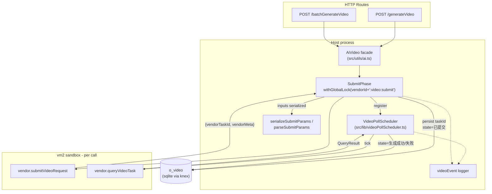
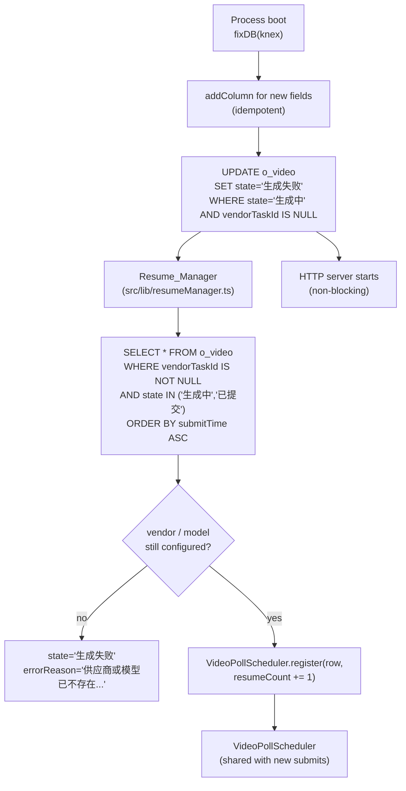
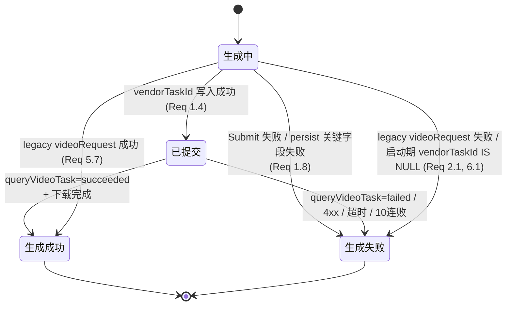

# Design Document — video-task-persistence-resume

## Overview

本特性把"提交视频任务 + 轮询直到完成"的合一闭环拆分为两个阶段：**Submit_Phase** 与 **Poll_Phase**。Submit_Phase 仍由供应商沙箱脚本完成，但只负责拿到 `vendorTaskId` 并把恢复所需的最小信息持久化到 `o_video`；Poll_Phase 整个迁出 vm2 沙箱，由宿主侧的 `VideoPollScheduler` 统一调度。沙箱脚本的模块级状态在 `getVendorTemplateFn` 每次调用时随 `u.vm(jsCode)` 重建（参考 `src/utils/ai.ts`），无法承载长周期的轮询闭包；把 Poll_Phase 上提到宿主之后，进程重启时只要数据库里有 `vendorTaskId`，宿主就能让 `Resume_Manager` 重新调度查询，从而避免目前 `fixDB.ts` 把所有 `state='生成中'` 行强制失败、迫使用户重提的体验问题（满足 Requirement 1、Requirement 2、Requirement 4）。

设计同时引入 `vendorId / modelName / submitParams / submitTime / lastPollTime / pollAttempt / resumeCount` 等列以承载恢复元数据，并增加一个明确的中间态 `已提交`，从而把状态机限定在 `生成中 → 已提交 → {生成成功 | 生成失败}`（满足 Requirement 5）。对外 HTTP 契约完全保持不变（满足 Requirement 6）。

设计范围**不**包括：将 textRequest / imageRequest / ttsRequest 也宿主化、对供应商 API 鉴权机制的变更、对前端轮询接口的协议变更、引入新的消息队列或外部调度器。

## Architecture

### 运行时拓扑



满足 Requirement 1.3、1.4、3.1、3.2、4.1、8.1、8.2。

### 启动期恢复流



`Resume_Manager` 与 `HTTP server` 并行启动；前者不在 `fixDB` 的同一阻塞链路上等待，因此服务可立即对外可用（满足 Requirement 2.1、2.2、2.3、2.4、2.5、2.6）。

## Components and Interfaces

### 组件清单

| 组件 | 文件 | 职责 |
| --- | --- | --- |
| `AiVideo` | `src/utils/ai.ts` | 对外 facade。`run()` 依旧返回 `Promise<void>`，但内部改为"提交 + 注册到调度器 + 等调度器终态信号"。 |
| `SubmitPhase` | `src/utils/ai.ts`（私有函数） | 构造请求、串行加锁、调用 `submitVideoRequest`、写库。 |
| `VideoPollScheduler` | 新增 `src/lib/videoPollScheduler.ts` | 进程内单例。维护 `videoId -> Job` map；负责定时器、退避、超时、断路器、单飞（single-flight）查询、终态写库。 |
| `Resume_Manager` | 新增 `src/lib/resumeManager.ts` | 启动期扫描 Resumable 行并注册到 `VideoPollScheduler`。 |
| `serializeSubmitParams` / `parseSubmitParams` | 新增 `src/utils/videoSubmitParams.ts` | `submitParams` 列的序列化器与解析器，含 1 MiB 截断算法。 |
| `videoEvent` logger | 新增 `src/utils/videoLog.ts` | 输出 `event=...` 形式的结构化日志，并对 `referenceList` 做 redaction。 |
| `fixDB` | `src/lib/fixDB.ts` | 改为只对 `vendorTaskId IS NULL` 的 `生成中` 行兜底，不再一刀切。 |
| Vendor adapters | `data/vendor/*.ts` | 新增 `submitVideoRequest` / `queryVideoTask` 两个导出，保留旧的 `videoRequest`。 |

### Vendor adapter 契约

供应商脚本现行只暴露：

```ts
// 现状（保留作为 fallback）
exports.videoRequest = (config: VideoConfig, model: VideoModel) => Promise<string>;
```

本特性新增：

```ts
// 新版契约
exports.submitVideoRequest = (
  config: VideoConfig,
  model: VideoModel,
) => Promise<{
  vendorTaskId: string;
  vendorMeta?: Record<string, unknown>; // JSON-serializable, 用于查询接口的额外上下文
}>;

exports.queryVideoTask = (
  args: { vendorTaskId: string; vendorMeta?: Record<string, unknown> },
  model: VideoModel,
) => Promise<QueryResult>;
```

`QueryResult` 是判别联合（满足 Requirement 3.2、3.5、3.6、3.7）：

```ts
type QueryResult =
  | { status: "pending"; progress?: number }
  | { status: "succeeded"; data: string /* url 或 base64 */ }
  | {
      status: "failed";
      error: string;
      errorClass?: "client_4xx" | "task_not_found" | "server_5xx" | "network" | "vendor_business";
    };
```

宿主侧调用解析顺序（满足 Requirement 3.3、3.4、3.8）：

```ts
function pickVideoStrategy(adapter: Record<string, any>): VideoStrategy {
  if (typeof adapter.submitVideoRequest === "function" && typeof adapter.queryVideoTask === "function") {
    return { kind: "split", submit: adapter.submitVideoRequest, query: adapter.queryVideoTask };
  }
  if (typeof adapter.videoRequest === "function") {
    return { kind: "legacy", run: adapter.videoRequest };
  }
  throw new Error("Vendor 不支持视频生成");
}
```

`legacy` 路径直接走旧的提交+轮询合一流程（即调用 `videoRequest` 并保留 `state='生成中'` 直到终态），但在 `o_video.errorReason` 之外**额外**写一个标记位（仅用于运维区分）：恢复期遇到这种行时按 Requirement 2.1 的兜底处理。

#### 适配器迁移指南（给 vendor 作者）

把现有 `videoRequest` 拆分为新版的两步式实现，对照模板：

```ts
// 旧实现（合一）
const videoRequest = async (config, model) => {
  const taskId = await submitToVendor(config, model);
  const r = await pollTask(async () => queryVendor(taskId), 5000, 1800000);
  if (r.error) throw new Error(r.error);
  return await urlToBase64(r.data!);
};

// 新实现（拆分）
const submitVideoRequest = async (config, model) => {
  const taskId = await withGlobalLock(`${vendor.id}:video:submit`, () => submitToVendor(config, model));
  return { vendorTaskId: taskId, vendorMeta: { region: vendor.inputValues.region } /* 仅在需要时 */ };
};
const queryVideoTask = async ({ vendorTaskId, vendorMeta }, model) => {
  try {
    const raw = await queryVendor(vendorTaskId, vendorMeta);
    if (raw.status === "succeeded") return { status: "succeeded", data: raw.url };
    if (raw.status === "failed") return { status: "failed", error: raw.reason, errorClass: "vendor_business" };
    return { status: "pending", progress: raw.progress };
  } catch (e) {
    if (is4xx(e)) return { status: "failed", error: errorMessage(e), errorClass: e.status === 404 ? "task_not_found" : "client_4xx" };
    throw e; // 让宿主调度器记入失败计数 + 退避
  }
};

// 兼容旧入口：本地直接组合一次完整生命周期
const videoRequest = async (config, model) => {
  const { vendorTaskId, vendorMeta } = await submitVideoRequest(config, model);
  const r = await pollTask(async () => {
    const q = await queryVideoTask({ vendorTaskId, vendorMeta }, model);
    if (q.status === "succeeded") return { completed: true, data: q.data };
    if (q.status === "failed") return { completed: true, error: q.error };
    return { completed: false };
  });
  if (r.error) throw new Error(r.error);
  return await urlToBase64(r.data!);
};
```

注意：`queryVideoTask` 不要在内部使用 `pollTask`，**不要循环**；它必须是"打一次查询、立刻返回"。所有循环 / 退避 / 超时由宿主调度器接管（满足 Requirement 4.1、4.7）。

### `AiVideo` refactor

公共 API 完全保持稳定（`u.Ai.Video(model).run(input, taskRecord?)` 仍返回 `Promise<void>`，调用方无感）。内部改写：

```ts
class AiVideo {
  private key: `${string}:${string}`;
  private result: string = "";
  constructor(key) { this.key = key; }

  // 与现有调用点保持签名一致（generateVideo.ts / batchGenerateVideo.ts）
  async run(input: VideoConfig, taskRecord?: TaskRecord, ctx?: { videoId: number }): Promise<this> {
    if (!ctx?.videoId) throw new Error("AiVideo.run 需要外部已经创建好 o_video 行 (videoId)");
    const modelName = await resolveModelName(this.key);
    const [vendorId, modelKey] = modelName.split(/:(.+)/);

    // 1) Submit_Phase（带锁；写 vendorId/modelName/submitParams/submitTime；调供应商提交；写 vendorTaskId 转入"已提交"）
    const { vendorTaskId, vendorMeta } = await runSubmitPhase({
      videoId: ctx.videoId,
      vendorId,
      modelKey,
      input,
    });

    // 2) 注册到 VideoPollScheduler 并 await 终态 promise（保持 run() Promise 与终态对齐）
    const final = await VideoPollScheduler.registerAndWait({
      videoId: ctx.videoId,
      vendorId,
      modelKey,
      vendorTaskId,
      vendorMeta,
      submitTime: /* 来自 Submit_Phase 写入的 submitTime */,
    });

    if (final.kind === "succeeded") {
      this.result = final.data;
      return this;
    }
    throw new Error(final.error);
  }

  async save(path: string) {
    await u.oss.writeFile(path, this.result);
    return this;
  }
}
```

`generateVideo.ts` / `batchGenerateVideo.ts` 调用方需要把已经分配好的 `videoId` 通过 `ctx` 传进来（这两个路由本来就先 `INSERT o_video` 再调用 `aiVideo.run(...)`，参考 `src/routes/production/workbench/generateVideo.ts`）。这是唯一对调用方的小改动；`run()` / `save()` 的语义不变，因此 `.then(() => save).then(() => UPDATE state=生成成功)` 的链式结构保留——只是 `state=生成成功` 的写入在调度器里已经写过一次（幂等覆盖到相同终态）。

> 备选方案：完全不改路由文件，改由调度器在拿到 `data` 后完成 `oss.writeFile(filePath)`。本设计选择最小侵入：路由保留 save/UPDATE 的写法不动，仅把 `videoId` 传递给 `run`。

### `VideoPollScheduler`

```ts
type JobState = "running" | "querying" | "stopped";
type Job = {
  videoId: number;
  vendorId: string;
  modelKey: string;
  vendorTaskId: string;
  vendorMeta?: Record<string, unknown>;
  submitTime: number;          // 来自 o_video.submitTime，恢复时也直接复用，不重置
  pollAttempt: number;
  consecutiveFailures: number; // 用于 4.4 的 10 次断路器
  lastError?: string;
  intervalMs: number;          // 默认 30000，可被 model 配置覆盖至 [3000, 300000]
  backoffMs: number;           // 错误后下次的间隔（2,4,8,16,30s）
  abort: AbortController;      // 用于外部取消
  state: JobState;
  resolve: (r: TerminalSignal) => void; // run() 等待的 promise
};
type TerminalSignal =
  | { kind: "succeeded"; data: string /* url/base64 */ }
  | { kind: "failed"; error: string };

class VideoPollScheduler {
  private jobs = new Map<number, Job>(); // videoId -> Job
  private byVendorTaskId = new Map<string, number>(); // 全局 single-flight 防重入

  registerAndWait(args: {...}): Promise<TerminalSignal>;
  resumeFromRow(row: VideoRow): Promise<void>; // Resume_Manager 调
  observeExternalTerminal(videoId: number): void; // 外部置终态时的取消
  private tick(job: Job): Promise<void>; // 单次查询 + 决策
  private scheduleNext(job: Job, delayMs: number): void;
}
```

**调度行为细节**

| 触发 | 行为 | 满足 |
| --- | --- | --- |
| `register` | 把 Job 入 map；设置 `state=已提交`（由 SubmitPhase 已写）；若 `byVendorTaskId.has(vendorTaskId)` 则把新调用合并到旧 Job 的 promise，不发起重复查询 | 4.8、8.5 |
| `tick` | 调 `queryVideoTask`；按 QueryResult 分支决策 | 4.1、4.2 |
| 错误（throw 或 `status==='failed'` 含 errorClass=`server_5xx`/`network`） | `consecutiveFailures+=1`；退避数列 `[2,4,8,16,30]s`，按 `min(consecutiveFailures-1, 4)` 取 | 4.4、7.3 |
| 错误 `errorClass=client_4xx` 或 `task_not_found` | 立即终态失败，绕过 10 次计数 | 4.6、7.1 |
| `Date.now() - submitTime >= 86_400_000` | 终态失败 `errorReason='轮询超时'` | 4.3、7.2 |
| `consecutiveFailures >= 10` | 终态失败 `errorReason=lastError` | 4.5 |
| 成功 + `data` 是 URL | 调 `urlToBase64`，失败时按 7.4 处理 | 7.4 |
| 每次查询前 / 后 | 写 `lastPollTime = Date.now(); pollAttempt += 1` | 4.2 |
| `tick` 前先 SELECT 该行 | 若 `state ∈ {生成成功,生成失败}` 或行已被删除 → `state=stopped` 并不再调度 | 7.5、5.5、5.6 |
| 终态写库 | `UPDATE ... WHERE id = ? AND state NOT IN ('生成成功','生成失败')`，保证终态吸收 | 5.5、INV-1 |

**单飞 (single-flight) 实现**：`byVendorTaskId` 在每次 `tick` 进入查询前 `set(vendorTaskId, videoId)`，离开时仍保留键直到 Job 终止；并发的 `register` / `resumeFromRow` 若发现已有 Job 则把自己的 `resolve` 合并进入旧 Job，不另起轮询循环（满足 Requirement 4.8、8.5）。

### `Resume_Manager`

伪代码（满足 Requirement 2.3、2.4、2.5、2.6、9.3）：

```ts
export async function runResume(deps: { db; scheduler: VideoPollScheduler; logger }) {
  const rows = await deps.db("o_video")
    .whereNotNull("vendorTaskId")
    .whereIn("state", ["生成中", "已提交"])
    .orderBy("submitTime", "asc")
    .select("*");

  for (const row of rows) {
    const vendorOk = await u.db("o_vendorConfig").where("id", row.vendorId).first();
    let modelOk = false;
    if (vendorOk) {
      const list = await u.vendor.getModelList(row.vendorId).catch(() => []);
      modelOk = !!list.find((m) => m.modelName === row.modelName);
    }
    if (!vendorOk || !modelOk) {
      await deps.db("o_video").where("id", row.id).update({
        state: "生成失败",
        errorReason: "供应商或模型已不存在，无法恢复",
      });
      continue;
    }

    await deps.db("o_video").where("id", row.id).increment("resumeCount", 1);
    deps.logger({
      event: "video_resume_scheduled",
      videoId: row.id,
      vendorTaskId: row.vendorTaskId,
      resumeCount: (row.resumeCount ?? 0) + 1,
    });

    // 不 await，避免一次性把所有 query 同时发出去；scheduler 内部按 intervalMs 调度
    deps.scheduler.resumeFromRow(row).catch((e) => {
      deps.logger({ event: "video_resume_register_failed", videoId: row.id, error: errorMessage(e) });
    });
  }
}
```

调用点：放在 `fixDB` 完成迁移与状态修正之后、HTTP 监听启动**之前**调度但**不 await**——也就是 `setImmediate(() => runResume(...))`。这保证 HTTP 服务尽快可服务（满足 Requirement 2.6）。

## Data Models

### `o_video` 列扩展

满足 Requirement 1.1。SQL 等价 DDL（实际通过 `fixDB.addColumn` 幂等执行，满足 Requirement 1.2）：

```sql
ALTER TABLE o_video ADD COLUMN vendorId      TEXT;
ALTER TABLE o_video ADD COLUMN modelName     TEXT;
ALTER TABLE o_video ADD COLUMN vendorTaskId  TEXT;
ALTER TABLE o_video ADD COLUMN submitParams  TEXT;
ALTER TABLE o_video ADD COLUMN submitTime    INTEGER;
ALTER TABLE o_video ADD COLUMN lastPollTime  INTEGER;
ALTER TABLE o_video ADD COLUMN pollAttempt   INTEGER DEFAULT 0;
ALTER TABLE o_video ADD COLUMN resumeCount   INTEGER DEFAULT 0;
```

`fixDB.ts` 中相应迁移代码形状：

```ts
await addColumn("o_video", "vendorId", "text");
await addColumn("o_video", "modelName", "text");
await addColumn("o_video", "vendorTaskId", "text");
await addColumn("o_video", "submitParams", "text");
await addColumn("o_video", "submitTime", "integer");
await addColumn("o_video", "lastPollTime", "integer");
await addColumn("o_video", "pollAttempt", "integer");
await addColumn("o_video", "resumeCount", "integer");

// 仅对未提交成功的"生成中"行兜底（替换原先的整表更新），满足 Requirement 2.1
await db("o_video")
  .where("state", "生成中")
  .whereNull("vendorTaskId")
  .update({ state: "生成失败", errorReason: "软件退出导致失败（任务未提交至供应商）" });

// 第一次部署本特性时也要一刀切迁移前残留行，满足 Requirement 6.1
// 注：上述同一条 SQL 即可覆盖，因为旧数据 vendorTaskId 必为 NULL
```

`initDB.ts`（仅用于全新建表）的 `o_video` 定义同步追加这些列（保持新装实例无需 alter）。

### State 字段

约束在 `{"生成中","已提交","生成成功","生成失败"}` 四个字符串字面量内（满足 Requirement 5.1）。前端语义见"Backward compatibility"小节。

### `submitParams` 序列化

文件：`src/utils/videoSubmitParams.ts`。

```ts
export interface SerializedSubmitParams {
  // 核心字段（与 VideoConfig 同构）
  prompt: string;
  duration: number;
  resolution: string;
  aspectRatio: "16:9" | "9:16";
  audio?: boolean;
  mode: VideoMode[];
  referenceList?: ReferenceList[]; // base64 字段在未触发截断时原文保留
  vendorMeta?: Record<string, unknown>;
  // 元数据
  schemaVersion: 1;
  truncated?: true;                // 触发截断时为 true，并配合下面的字段
  truncatedFields?: string[];      // 被截掉的字段路径列表，例如 ["referenceList"]
}

export function serializeSubmitParams(p: VideoConfig & { vendorMeta?: any }): string;
export function parseSubmitParams(s: string): SerializedSubmitParams;
```

**截断算法**（满足 Requirement 1.5、1.6、9.5）：

```ts
const LIMIT = 1024 * 1024; // 1 MiB
function serializeSubmitParams(p) {
  const full = { schemaVersion: 1, ...p };
  const s = JSON.stringify(full);
  if (Buffer.byteLength(s, "utf8") <= LIMIT) return s;

  // 截断：把所有 referenceList[*].base64 替换为空串，记录被截掉的字段
  const truncated = {
    ...full,
    truncated: true as const,
    truncatedFields: ["referenceList[*].base64"],
    referenceList: (full.referenceList ?? []).map((r) => ({ ...r, base64: "" })),
  };
  const s2 = JSON.stringify(truncated);
  if (Buffer.byteLength(s2, "utf8") <= LIMIT) return s2;

  // 极端情况下连去掉 base64 仍超限：再丢 referenceList 整体
  const minimal = {
    ...full,
    truncated: true as const,
    truncatedFields: ["referenceList"],
    referenceList: undefined,
  };
  return JSON.stringify(minimal);
}
```

`parseSubmitParams` 是 `JSON.parse` 加上 `schemaVersion === 1` 校验，对非法 JSON 抛出 `Error("submitParams JSON 解析失败：" + s.slice(0, 200))`，**不**静默回退（满足 Requirement 11.3）。

## State Machine

满足 Requirement 5。



终态吸收（满足 Requirement 5.5、5.6、INV-1）通过所有终态写入的 `WHERE state NOT IN ('生成成功','生成失败')` 守卫子句保证。

## Concurrency model

| 资源 | 并发策略 | 满足 |
| --- | --- | --- |
| Submit 提交 | `withGlobalLock("${vendorId}:video:submit", fn)`，跨任务串行；锁键以 `vendorId` 为粒度——不同供应商互不阻塞 | 8.1 |
| Poll 查询 | **不**取锁。每个 `vendorTaskId` 由 `byVendorTaskId` map 保证全局至多一个 in-flight 查询 | 4.7、4.8、8.5 |
| 启动恢复 + 新提交 | Resume_Manager 直接进入 Poll_Phase，不进 Submit 锁队列；新提交按 8.1 排队，与正在轮询的恢复任务互不阻塞 | 8.3、8.4 |
| 同一 videoId 的 `register` 重复触发 | 在 `videoId` 已存在时 reject 重复注册，或合并 promise；幂等 | INV-2 |

锁键的命名 = `${vendorId}:video:submit`。当前 `data/vendor/agnesai.ts` 用的是字面量 `agnesai:video:submit`，本特性改为由宿主在 `runSubmitPhase` 中统一施加，沙箱脚本无需自己加锁（保留也无害，因为 `withGlobalLock` 是可重入兼容的——同 key 再嵌套等价于排队一次 + 立即放行）。

## Logging & observability

文件：`src/utils/videoLog.ts`。

```ts
type VideoEvent =
  | "video_submit_start" | "video_submit_done" | "video_persist_taskid_failed"
  | "video_resume_scheduled" | "video_resume_register_failed"
  | "video_poll_tick" | "video_poll_succeeded" | "video_poll_failed"
  | "video_poll_circuitbreak" | "video_poll_timeout" | "video_poll_external_terminal";

export function videoEvent(payload: { event: VideoEvent } & Record<string, unknown>) {
  const safe = redact(payload);
  console.log("【VIDEO】" + JSON.stringify(safe));
}

function redact(o: any): any {
  // 移除 referenceList[*].base64、不输出 submitParams 整体超过 1k 的字符串
  // 仅保留 referenceList[*].type 与 base64 长度
}
```

事件样例（满足 Requirement 9.1–9.5）：

```json
{"event":"video_submit_start","videoId":12,"vendorId":"agnesai","modelName":"agnes-video-v2.0","ts":1737000000000}
{"event":"video_submit_done","videoId":12,"vendorTaskId":"vtsk_abc","ts":1737000003000}
{"event":"video_resume_scheduled","videoId":12,"vendorTaskId":"vtsk_abc","resumeCount":1,"ts":1737000060000}
{"event":"video_poll_succeeded","videoId":12,"pollAttempt":7,"durationMs":210000}
{"event":"video_poll_failed","videoId":12,"pollAttempt":3,"durationMs":42000,"reason":"task_not_found"}
```

`referenceList` 中的 `base64` **不**输出原文，只输出 `{type, base64Length}`（满足 Requirement 9.5）。

## Backward compatibility

满足 Requirement 6 全部条款。

1. `fixDB` 的迁移 SQL 同时覆盖"启动期遗留的 in-flight 行"和"旧版本部署遗留的、永远没有 `vendorTaskId` 的行"——两者都满足 `state='生成中' AND vendorTaskId IS NULL`，因此一条 UPDATE 即可（Requirement 2.1、6.1）。其中 `errorReason` 在升级首次启动统一写为 `"软件退出导致失败（任务未提交至供应商）"`，足以覆盖 6.1 的语义而不需要分两次 UPDATE。
2. 路由 `checkVideoStateList` / `getVideoList` / `batchGenerateVideo` 不改协议；`已提交` 在 UI 视角等同于"进行中"，由前端原本的 `state ∈ {"生成中","已提交"}` 判定 → 进行中（如前端只识别 `"生成中"`，则在 API 响应里把 `已提交` 映射回 `生成中`，由统一的响应映射函数 `mapVideoStateForUi` 处理，不在数据库层改写）。Requirement 6.2、6.3、6.4。
3. `checkVideoStateList` 可选附带 `state` 原值字段（如 `"stateRaw": "已提交"`），用于需要区分 `已提交` 的调用方；不破坏现有字段。Requirement 6.5。
4. Legacy 适配器（仅暴露 `videoRequest`）：宿主不进入 split 路径，调用 `videoRequest` 一次性走完，且把 `Video_Row.errorReason` 上的隐含说明留给运维（不需要在每次成功路径上都写 errorReason，因为最终终态会覆盖）。重启后这种行不会有 `vendorTaskId`，按 Requirement 2.1、3.4 自动失败兜底。

## Correctness Properties

*A property is a characteristic or behavior that should hold true across all valid executions of a system—essentially, a formal statement about what the system should do. Properties serve as the bridge between human-readable specifications and machine-verifiable correctness guarantees.*

### Property 1: Submit-Persistence ordering

*For any* `VideoConfig` input and any fake `submitVideoRequest` that returns a `vendorTaskId`, by the time the host enters Poll_Phase the corresponding `o_video` row already has `vendorId`、`modelName`、`submitParams`、`submitTime` 写入（在调用 `submitVideoRequest` 之前），并且 `state='已提交'` 与 `vendorTaskId=<value>` 在第一次 `queryVideoTask` 被调用之前已写入。

**Validates: Requirements 1.3, 1.4, 5.3**

### Property 2: SubmitParams round-trip

*For any* `VideoConfig & { vendorMeta? }` 对象 `p`，若 `Buffer.byteLength(JSON.stringify(p),"utf8") <= 1 MiB`，则 `parseSubmitParams(serializeSubmitParams(p))` 在结构上等价于 `p`（不含 `truncated` 标记）。

**Validates: Requirements 1.6, 10.5, 11.4**

### Property 3: SubmitParams idempotent serialization

*For any* 由 `serializeSubmitParams` 产生的合法字符串 `s`，`serializeSubmitParams(parseSubmitParams(s))` 在键顺序归一化后等价于 `s`。

**Validates: Requirements 11.5**

### Property 4: SubmitParams truncation invariant

*For any* `p`，`serializeSubmitParams(p)` 输出字节长度 ≤ 1 MiB；当原始 `JSON.stringify(p)` 超出 1 MiB 时，输出反序列化后必有 `truncated === true`、`truncatedFields` 非空，且 `prompt`、`duration`、`resolution`、`aspectRatio`、`mode` 字段保留原值。

**Validates: Requirements 1.5**

### Property 5: ParseSubmitParams error contains prefix

*For any* 字符串 `s` 不是合法 JSON，`parseSubmitParams(s)` 抛出错误且错误信息包含 `s.slice(0, 200)`。

**Validates: Requirements 11.3**

### Property 6: Boot recovery predicate

*For any* 启动前的 `o_video` 行集合 `R`，运行 `fixDB` 后：所有 `r ∈ R` 满足 `r.state='生成中' AND r.vendorTaskId IS NULL` 的行被更新为 `state='生成失败'` 且 `errorReason='软件退出导致失败（任务未提交至供应商）'`；同时所有 `r.vendorTaskId IS NOT NULL AND r.state ∈ {生成中,已提交}` 的行的 `state`、`vendorTaskId`、`submitParams` 保持不变。

**Validates: Requirements 2.1, 2.2, 6.1**

### Property 7: No residual submitting state after recovery

*For any* 启动前的 `o_video` 行集合 `R`，在 `fixDB` 与 `Resume_Manager` 完成后（且无新提交进入），所有非删除行 `state ∈ {"已提交","生成成功","生成失败"}`，且不存在 `state='生成中'` 的行。

**Validates: Requirements 10.6**

### Property 8: Resume schedule ordering by submitTime

*For any* Resumable 行集合，`Resume_Manager.runResume` 触发 `VideoPollScheduler.resumeFromRow` 的调用顺序与按 `submitTime` 升序排序的行序一致。

**Validates: Requirements 2.3**

### Property 9: Resume counter increment

*For any* 单次启动恢复，每条 Resumable 行恢复后 `resumeCount = (旧值 ?? 0) + 1`。

**Validates: Requirements 2.4**

### Property 10: Missing vendor or model fails the row

*For any* Resumable 行 `r`，若 `o_vendorConfig.id=r.vendorId` 不存在，或 `r.vendorId` 的 modelList 中不存在 `modelName=r.modelName`，则恢复后 `r.state='生成失败'` 且 `errorReason='供应商或模型已不存在，无法恢复'`。

**Validates: Requirements 2.5**

### Property 11: Strategy selection

*For any* adapter 对象 `a`，
`pickVideoStrategy(a).kind === 'split'` 当且仅当 `typeof a.submitVideoRequest === 'function' && typeof a.queryVideoTask === 'function'`；否则当 `typeof a.videoRequest === 'function'` 时为 `'legacy'`，否则抛出 `Error("Vendor 不支持视频生成")`。

**Validates: Requirements 3.3, 3.4**

### Property 12: VendorMeta pass-through on resume

*For any* `vendorMeta` 持久化在 `submitParams` 中的 Resumable 行，`Resume_Manager` 恢复后第一次调用 `queryVideoTask` 的入参 `args.vendorMeta` 与持久化值结构等价。

**Validates: Requirements 3.7**

### Property 13: Query terminal signal maps to DB terminal state

*For any* `QueryResult` 序列，最终一次终态信号决定 DB 状态：`{status:'succeeded',data}` ⇒ `state='生成成功'`（且 `urlToBase64` 已成功完成），`{status:'failed',error}` ⇒ `state='生成失败' AND errorReason=error`。

**Validates: Requirements 3.5, 3.6, 5.4**

### Property 14: Interval clamp

*For any* 模型配置中给出的 `intervalMs` 数值（含越界、负数、NaN），调度器实际使用的间隔 `effectiveInterval ∈ [3000, 300000]`，且当输入为 `undefined` 时为 `30000`。

**Validates: Requirements 4.1**

### Property 15: PollAttempt monotone counter

*For any* `N >= 0` 次连续的 `tick` 调用（不区分成功 / 失败），`pollAttempt` 单调递增 `N` 次（即 `pollAttempt(after) - pollAttempt(before) === N`）。

**Validates: Requirements 4.2**

### Property 16: 24h timeout from submitTime

*For any* `submitTime`，当 `Date.now() - submitTime >= 86_400_000` 时下一次 `tick` 必把行置为 `state='生成失败' AND errorReason='轮询超时'`，且 `submitTime` 不会因 `Resume` 重置。

**Validates: Requirements 4.3, 7.2**

### Property 17: Circuit breaker + backoff

*For any* 长度 ≥ 1 的查询结果序列，若结果是错误（throw 或 `errorClass ∈ {server_5xx, network, vendor_business}`），第 `n` 次连续失败后下次延迟 `=` `[2000,4000,8000,16000,30000][min(n-1, 4)]` 毫秒；当 `n` 达到 10 时下一次 `tick` 把行置为 `state='生成失败' AND errorReason=lastError`。

**Validates: Requirements 4.4, 4.5, 7.3**

### Property 18: Fast fail on 4xx / task_not_found

*For any* 单次 `QueryResult` 满足 `status='failed' AND errorClass ∈ {client_4xx, task_not_found}`，下一次状态写入即终态失败：`errorClass='task_not_found'` ⇒ `errorReason='供应商任务已不存在或已过期'`；其他 4xx ⇒ `errorReason=error`。不进入 10 次断路器。

**Validates: Requirements 4.6, 7.1**

### Property 19: Poll phase is lock-free

*For any* 交错的 `submit` / `tick` 操作序列，`tick` 体内不调用 `withGlobalLock("${vendorId}:video:submit", ...)`，因此正在进行的轮询不会延迟新提交进入锁队列。

**Validates: Requirements 4.7, 8.2, 8.4**

### Property 20: Single-flight per vendorTaskId

*For any* 并发 `register` / `resumeFromRow` 触发序列，对同一 `vendorTaskId`，任意时刻 `queryVideoTask` 的 in-flight 调用数 ≤ 1。

**Validates: Requirements 4.8, 8.5**

### Property 21: Submit serialization (per vendor key)

*For any* `N` 个并发的 `withGlobalLock("${vendorId}:video:submit", fn)` 调用，所有 `fn` 的 `[startTs, endTs]` 区间两两不重叠（按完成时间序排列时严格首尾相接或留有间隙）。

**Validates: Requirements 8.1, 10.4**

### Property 22: Terminal absorption

*For any* `Video_Row` 当前 `state ∈ {'生成成功','生成失败'}`，对其后续任何来自调度器或恢复路径的写入请求执行后，`state` 保持不变。

**Validates: Requirements 5.5, 5.6, 10.1**

### Property 23: VendorTaskId monotone single-write

*For any* `Video_Row`，`vendorTaskId` 列的写入历史满足：仅有一次从 `NULL → v` 的写入；若再有写入，则写入值仍为 `v`。

**Validates: Requirements 10.2**

### Property 24: Terminal reachability under finite query series

*For any* Resumable 行 `r` 与一个会在有限轮 `K` 内返回终态信号的 `queryVideoTask` 序列，Poll_Phase 在最多 `K` 次 `tick`（外加常数时间）后把 `r.state` 转移到 `Terminal_State`。

**Validates: Requirements 10.3**

### Property 25: External cancellation stops polling

*For any* tick 时刻外部把 `Video_Row.state` 写为 Terminal_State 或删除该行，调度器在不晚于下一次 SELECT-before-tick 时停止该 Job，后续 `queryVideoTask` 调用次数有限（且不会再写库）。

**Validates: Requirements 7.5**

### Property 26: Download-failure reason prefix

*For any* `urlToBase64` 抛出的错误 `e`，写库后 `errorReason` 以 `'下载视频失败'` 前缀开头并包含 `e.message`。

**Validates: Requirements 7.4**

### Property 27: CheckVideoStateList filter

*For any* `o_video` 行集合，`checkVideoStateList` 响应里只包含 `state ∈ {'生成成功','生成失败'}` 的行；`state ∈ {'生成中','已提交'}` 的行不会出现在响应中。

**Validates: Requirements 6.2**

### Property 28: Structured log field schema

*For any* Submit_Phase / Resume / Poll 终态执行，对应日志事件至少包含以下字段（满足类型约束）：

| event | required keys |
| --- | --- |
| `video_submit_start` | `videoId`, `vendorId`, `modelName` |
| `video_submit_done` | `videoId`, `vendorTaskId` |
| `video_resume_scheduled` | `videoId`, `vendorTaskId`, `resumeCount` |
| `video_poll_succeeded` / `video_poll_failed` | `videoId`, `pollAttempt`, `durationMs` |

**Validates: Requirements 9.1, 9.2, 9.3, 9.4**

### Property 29: Log redaction

*For any* `submitParams` 含 `referenceList[*].base64`，`videoEvent(...)` 输出的 JSON 字符串不包含原 base64 字符串内容（只可能含 `base64Length` 数字与 `type` 字段）。

**Validates: Requirements 9.5**

## Error Handling

满足 Requirement 1.7、1.8、3.5、4.4、4.5、4.6、7.1–7.5。

| 错误类 | 来源 | 出现时机 | 处理决策 | 终态 / 状态 |
| --- | --- | --- | --- | --- |
| `submitVideoRequest` 抛错（任意原因） | vendor 沙箱 | Submit_Phase 内 | 直接 throw 给路由 catch；行此前已写 vendorId/modelName/submitParams/submitTime；vendorTaskId 仍为 NULL | `state='生成失败'`，`errorReason=e.message` |
| 写 `vendorId/modelName/submitParams/submitTime` 失败 | DB | Submit_Phase 入口 | 终止 Submit；不再调供应商 | `state='生成失败'`，`errorReason=持久化失败具体原因` (Req 1.8) |
| 写 `vendorTaskId` 失败 | DB | Submit_Phase 末尾 | 在内存中继续 Poll，但记下事件 `video_persist_taskid_failed`；进程崩则丢失 | `state='已提交'`（仅内存）；进程重启后会被 Req 2.1 兜底为失败 (Req 1.7) |
| `queryVideoTask` `errorClass='client_4xx'`（含 403/410） | vendor / 网络 | 任一 tick | 立即终态 | `state='生成失败'`，`errorReason=error` (Req 4.6) |
| `queryVideoTask` `errorClass='task_not_found'`（包括 HTTP 404 / 业务码） | vendor | 任一 tick | 立即终态，使用固定 reason | `state='生成失败'`，`errorReason='供应商任务已不存在或已过期'` (Req 7.1) |
| `queryVideoTask` `errorClass='server_5xx'` | vendor | 任一 tick | `consecutiveFailures+=1`，按 `[2,4,8,16,30]s` 退避；累计 10 → 终态 | 终态时 `state='生成失败' errorReason=lastError` (Req 7.3, 4.4, 4.5) |
| `queryVideoTask` 抛 NetworkError（DNS/超时） | 网络 | 任一 tick | 同 5xx | 同上 |
| `queryVideoTask` 返回 `status='failed'` 业务错误 | vendor | 任一 tick | 即时终态（不计入 10 次） | `state='生成失败'`，`errorReason=error` (Req 3.5) |
| `urlToBase64` 失败 | 网络 / 文件 | 终态 succeed 后下载阶段 | 终态失败，前缀化 | `state='生成失败'`，`errorReason='下载视频失败：' + e.message` (Req 7.4) |
| 24h 超时 | 调度器 | 每次 tick 进入前检查 | 强制终态 | `state='生成失败'`，`errorReason='轮询超时'` (Req 4.3, 7.2) |
| 外部把行置为 Terminal_State 或删除 | 路由 / 用户 | tick 之间 | 调度器侦测到，停止 Job 不再写库 | 不动 (Req 7.5) |
| Resume_Manager 找不到 vendor / model 配置 | 配置 | 启动恢复 | 强制终态 | `state='生成失败'`，`errorReason='供应商或模型已不存在，无法恢复'` (Req 2.5) |
| 升级前残留 `vendorTaskId IS NULL` | 数据迁移 | 首次启动 | 兜底终态 | `state='生成失败'`，`errorReason='软件退出导致失败（任务未提交至供应商）'` (Req 6.1, 2.1) |

## Testing Strategy

满足 Requirement 10、11 的可测性要求。

### Test layering

| 层 | 适用 properties / 行为 | 工具 |
| --- | --- | --- |
| Unit (PBT) | Property 2, 3, 4, 5, 11, 14, 15, 17, 21, 23 | `fast-check` 已在生态可用；node 内置 test runner / vitest |
| Unit (example) | 一次性结构断言 (1.7, 1.8, 5.2, 5.7, 6.3, 6.4, 6.5, 8.3, smoke 列存在、3.8) | vitest / node:test |
| Integration (in-process, fake vendor) | Property 1, 6, 7, 8, 9, 10, 12, 13, 16, 18, 19, 20, 22, 24, 25, 26, 27, 28, 29 | 真 sqlite + fake vendor adapter（确定性状态机） + 假时钟 (`@sinonjs/fake-timers`) |
| Smoke | 1.1（列存在）、3.8（每个 vendor 文件 typeof export） | 启动一次断言 |

PBT 配置：每个 property 至少 100 次迭代；测试名 tag 形如：

```
// Feature: video-task-persistence-resume, Property 22: For any Video_Row currently in Terminal_State, subsequent writes preserve state.
```

### Fake vendor adapter (integration baseline)

为 INV-3 / Property 24 与各类 query 行为测试提供确定性输入：

```ts
// test/fixtures/fakeVendor.ts
export function makeFakeVendor(script: QueryResult[]): {
  submitVideoRequest: (...) => Promise<{vendorTaskId: string}>;
  queryVideoTask: (...) => Promise<QueryResult>;
} {
  let i = 0;
  return {
    submitVideoRequest: async () => ({ vendorTaskId: "fake-" + cryptoUUID() }),
    queryVideoTask: async () => {
      const r = script[Math.min(i, script.length - 1)]; i++;
      if ((r as any).__throw) throw (r as any).__throw;
      return r;
    },
  };
}
```

### Property generators (sketch)

```ts
const referenceItem = fc.record({
  type: fc.constantFrom("image","audio","video"),
  base64: fc.string({ minLength: 0, maxLength: 4096 }),
});
const videoConfig = fc.record({
  prompt: fc.string(),
  duration: fc.integer({ min: 1, max: 60 }),
  resolution: fc.constantFrom("720p","1080p"),
  aspectRatio: fc.constantFrom("16:9","9:16"),
  audio: fc.option(fc.boolean()),
  mode: fc.array(fc.constantFrom("text","singleImage","endFrameOptional"), { minLength: 1, maxLength: 3 }),
  referenceList: fc.array(referenceItem, { minLength: 0, maxLength: 6 }),
  vendorMeta: fc.option(fc.dictionary(fc.string(), fc.jsonValue())),
});

const queryResult = fc.oneof(
  fc.record({ status: fc.constant("pending"), progress: fc.option(fc.integer({min:0, max:100})) }),
  fc.record({ status: fc.constant("succeeded"), data: fc.string({minLength:1}) }),
  fc.record({
    status: fc.constant("failed"),
    error: fc.string({minLength:1}),
    errorClass: fc.constantFrom("client_4xx","task_not_found","server_5xx","network","vendor_business"),
  }),
);
```

### Integration test plan

1. **Boot-recovery property 测试**（Property 6, 7, 8, 9, 10）：用 fast-check 生成 `o_video` 行集合（含各种 state × vendorTaskId 组合），写入临时 sqlite，调用 `fixDB(knex)` + `runResume(...)`，对结果断言。
2. **Polling timeline 测试**（Property 16, 17, 24, 25）：fake-timers 控制 `Date.now`，对一条任务跑出完整轮询轨迹；脚本由 `fc.array(queryResult)` 生成。
3. **Single-flight 测试**（Property 20）：监视 `queryVideoTask` 调用计数器，并发 register 100 次同一 `vendorTaskId`。
4. **Submit serialization 测试**（Property 21）：N 个并发 submit，记录 `Date.now()` 区间，断言区间不重叠。
5. **Strategy selection / vendorMeta 测试**（Property 11, 12）：fc 随机生成 adapter shape（含/不含 split / legacy 函数），断言 `pickVideoStrategy` 行为。
6. **Log redaction**（Property 29）：对随机 base64 字符串，截获 `console.log` 输出做字符串包含检查。

### 不在自动化范围

- Requirement 2.6（Resume_Manager 不阻塞 HTTP）通过 example 测试断言 `setImmediate` 注册顺序，无 PBT。
- 真实供应商接口的端到端集成不在此特性的自动测试中（受网络与配额制约）。

## Open questions and risks

1. **Vendor 内嵌 `pollQueue` 死代码**：`data/vendor/agnesai.ts` 内部维护了 `pollQueue` / `enqueuePoll` 把多任务串行轮询；新版宿主调度接管后这部分逻辑变为死代码（仅在 legacy 路径里仍生效）。短期保留以兼容；后续若所有 vendor 都迁移到 split 契约，可删除。
2. **调度器内存增长**：`VideoPollScheduler.jobs` 在长时间运行时可能堆积"已终态但未及时被 GC 的 Job 引用"。设计上每次终态写库后立即 `jobs.delete(videoId)` 并 `byVendorTaskId.delete(vendorTaskId)`；并辅以 `setInterval` 周期回收检查。需在压测中确认。
3. **启动风暴**：当 Resumable 行很多（数千条），`Resume_Manager` 把所有 Job 注册到调度器后第一拨 query 会同时发出。设计上在 Job 进入调度时为初次 tick 加一个 jitter `Math.random() * intervalMs`，避免雷击；但还需在大量行场景下回归。
4. **`已提交` 在前端兼容**：依赖 `mapVideoStateForUi` 的存在；现有路由若直接 `select state` 暴露给前端，UI 看到陌生字符串可能行为异常。需要在实现阶段把所有响应入口审一遍。
5. **`legacy + 重启` 体验**：仅支持 `videoRequest` 的供应商在重启后仍会被兜底为失败。设计明确接受这一妥协（Requirement 3.4 的脚注），不在本特性内提供进一步弥补。
6. **`urlToBase64` 已经在两个地方实现**：`src/utils/vm.ts`（沙箱注入版） vs `src/utils/ai.ts`（宿主带重试版）。Poll_Phase 在拿到 `data` 后由宿主下载，使用宿主版（带重试）；调度器需明确不要把下载步骤交回沙箱。

