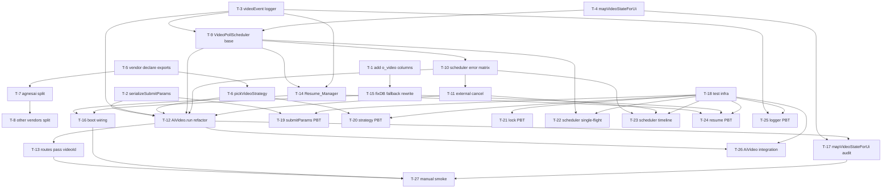

# Implementation Plan — video-task-persistence-resume

## Overview

任务按"先地基、再契约、再调度、再恢复、再兼容、最后测试与人工验证"的顺序排列，避免出现破坏性中间态。每个任务尽量保持单 PR 体量；`Validates` 引用 requirements.md 的 Requirement 编号与 design.md 的 Property 编号。所有"已提交"路径默认对前端透明（统一映射回 `生成中`），保证任务可分批合入。

## Tasks

---

## Phase 1: Foundations（数据库列、序列化、日志）

- [ ] **T-1 — 在 `o_video` 表新增持久化列**
  - 操作：在 `src/lib/initDB.ts` 的 `o_video` 表 builder 中追加 `vendorId / modelName / vendorTaskId / submitParams / submitTime / lastPollTime / pollAttempt / resumeCount` 列；在 `src/lib/fixDB.ts` 顶部使用现有的 `addColumn` 模式幂等迁移这些列。
  - Files: `src/lib/initDB.ts`, `src/lib/fixDB.ts`
  - Depends on: —
  - Validates: Requirement 1.1, 1.2

- [ ] **T-2 — 实现 `serializeSubmitParams` / `parseSubmitParams`（含 1 MiB 截断）**
  - 操作：新增 `src/utils/videoSubmitParams.ts`，按 design.md「submitParams 序列化」小节落地三级降级算法（原文 → 去 base64 → 整体丢 referenceList），并导出 `SerializedSubmitParams` 类型。
  - Files: `src/utils/videoSubmitParams.ts`
  - Depends on: —
  - Validates: Requirement 1.5, 1.6, 11.1, 11.2, 11.3 / Properties 2, 3, 4, 5

- [ ] **T-3 — 实现 `videoEvent` 结构化日志器（含 base64 redaction）**
  - 操作：新增 `src/utils/videoLog.ts`，导出 `videoEvent({event, ...})`，输出 `【VIDEO】<json>`；对 payload 中 `referenceList[*].base64` 做 `{type, base64Length}` 替换，其它字段透传。
  - Files: `src/utils/videoLog.ts`
  - Depends on: —
  - Validates: Requirement 9.1–9.5 / Properties 28, 29

- [ ] **T-4 — 实现 `mapVideoStateForUi` 映射工具**
  - 操作：新增 `src/utils/videoStateMap.ts`，导出 `mapVideoStateForUi(state)`：把 `已提交` 映射回 `生成中`，其它原样返回；同时导出常量集合 `TERMINAL_STATES = ["生成成功","生成失败"]`、`IN_PROGRESS_STATES = ["生成中","已提交"]`。
  - Files: `src/utils/videoStateMap.ts`
  - Depends on: —
  - Validates: Requirement 6.2, 6.4

---

## Phase 2: Vendor 适配器契约（先扩展、后引用）

- [ ] **T-5 — 在沙箱注入新工具与扩展 exports 类型声明（不破坏现有脚本）**
  - 操作：`src/utils/vm.ts` 已注入 `withGlobalLock`，本任务无功能改动；在 `data/vendor/agnesai.ts`、`data/vendor/grsai.ts` 等模板的 `declare const exports` 中追加可选项 `submitVideoRequest?` 与 `queryVideoTask?`，便于后续渐进式迁移。
  - Files: `data/vendor/agnesai.ts`, `data/vendor/grsai.ts`
  - Depends on: —
  - Validates: Requirement 3.1, 3.2

- [ ] **T-6 — 在 `getVendorTemplateFn` 增加 `pickVideoStrategy`**
  - 操作：`src/utils/ai.ts` 内新增 `pickVideoStrategy(adapter)`，返回 `split | legacy`；本任务只引入工具函数与类型，不改变 `AiVideo.run` 调用路径。
  - Files: `src/utils/ai.ts`
  - Depends on: T-5
  - Validates: Requirement 3.3, 3.4 / Property 11

- [ ] **T-7 — `data/vendor/agnesai.ts` 拆分为 `submitVideoRequest` + `queryVideoTask`**
  - 操作：把现有 `videoRequest` 中的提交段抽到 `submitVideoRequest`，返回 `{ vendorTaskId, vendorMeta? }`；轮询单步抽到 `queryVideoTask({ vendorTaskId, vendorMeta }, model)`，返回 `QueryResult`；保留 `videoRequest` 作为本地兼容层（内部组合两者跑完一次完整生命周期，满足 Requirement 3.8）。`queryVideoTask` 对 4xx / 404 / 业务失败按 design.md 矩阵设置 `errorClass`。
  - Files: `data/vendor/agnesai.ts`
  - Depends on: T-5
  - Validates: Requirement 3.1, 3.2, 3.5, 3.6, 3.7, 3.8

- [ ] **T-8（可选 / 分批） — 其余 vendor 适配器逐个迁移到 split 契约**
  - 操作：按需对 `data/vendor/grsai.ts`、`vidu.ts`、`klingai.ts`、`minimax.ts`、`volcengine.ts`、`volcengineSd2.ts` 复制 T-7 的迁移模式；未迁移的适配器自动走 legacy 路径，不影响主流程。
  - Files: `data/vendor/grsai.ts` 等
  - Depends on: T-7
  - Validates: Requirement 3.4, 3.8

---

## Phase 3: 宿主侧调度（VideoPollScheduler 与 AiVideo refactor）

- [ ] **T-9 — 实现 `VideoPollScheduler` 单例（基础调度、单飞、间隔 clamp）**
  - 操作：新增 `src/lib/videoPollScheduler.ts`，实现 `Job` 数据结构、`registerAndWait` / `resumeFromRow` / `tick` / `scheduleNext` / `observeExternalTerminal`；`videoId -> Job` map 与 `vendorTaskId -> videoId` 单飞 map；`intervalMs` 在 `[3000, 300000]` 区间夹紧，缺省 30000；`tick` 体内不持有 `Submit_Lock_Key`。本任务先不接通外部调用方。
  - Files: `src/lib/videoPollScheduler.ts`
  - Depends on: T-3, T-4
  - Validates: Requirement 4.1, 4.2, 4.7, 4.8, 8.2, 8.5 / Properties 14, 15, 19, 20

- [ ] **T-10 — `VideoPollScheduler` 加 24h 超时、10 连败断路器、4xx fast-fail、5xx 退避**
  - 操作：在 T-9 基础上补全错误矩阵：连续失败计数 + `[2,4,8,16,30]s` 退避；`errorClass ∈ {client_4xx, task_not_found}` 立即终态（含固定 reason 文案）；`Date.now() - submitTime ≥ 86_400_000` 触发轮询超时；下载阶段 `urlToBase64` 失败前缀化错误；终态写库使用 `WHERE state NOT IN (终态)` 守卫。
  - Files: `src/lib/videoPollScheduler.ts`
  - Depends on: T-9
  - Validates: Requirement 4.3, 4.4, 4.5, 4.6, 7.1, 7.2, 7.3, 7.4, 5.5, 5.6 / Properties 16, 17, 18, 22, 26

- [ ] **T-11 — `VideoPollScheduler` 加外部取消感知**
  - 操作：每次 `tick` 进入前先 `SELECT state FROM o_video WHERE id = ?`，若行已不存在或已是终态（被 delVideo 之类外部置态）则停止 Job、清理 maps、不再写库。
  - Files: `src/lib/videoPollScheduler.ts`
  - Depends on: T-10
  - Validates: Requirement 7.5 / Property 25

- [ ] **T-12 — `AiVideo.run` 改造为「Submit + register-poll」**
  - 操作：在 `src/utils/ai.ts` 的 `AiVideo.run` 中：
    1. 接收新参数 `ctx?: { videoId: number }`；缺省时保留旧行为兼容 textRequest/imageRequest 入口（视频路径必须传入 `ctx.videoId`）。
    2. 在 SubmitPhase 内：先 `UPDATE o_video SET vendorId, modelName, submitParams, submitTime` → 调用 `withGlobalLock(\`${vendorId}:video:submit\`, () => submitVideoRequest(...))` → `UPDATE o_video SET vendorTaskId, state='已提交'`（带终态守卫与 INV-2 单调写校验）。
    3. 调 `VideoPollScheduler.registerAndWait(...)` 并 await；终态 succeeded 时把 `data` 赋给 `this.result`，failed 时 throw。
    4. legacy adapter 走原 `videoRequest` 一次性流程，状态保持 `生成中` 直到终态（保留 Requirement 5.7 通路）。
  - Files: `src/utils/ai.ts`
  - Depends on: T-2, T-3, T-6, T-9, T-10, T-11
  - Validates: Requirement 1.3, 1.4, 1.7, 1.8, 5.2, 5.3, 5.4, 5.7, 8.1 / Properties 1, 13, 21, 23

- [ ] **T-13 — 路由调用方传入 `videoId` 上下文**
  - 操作：`src/routes/production/workbench/generateVideo.ts` 与 `batchGenerateVideo.ts` 在调用 `aiVideo.run(input, taskRecord, { videoId })` 时把已分配的 `videoId` 传入；`.then(save).then(UPDATE state=生成成功)` 链保留（终态写库幂等覆盖）。
  - Files: `src/routes/production/workbench/generateVideo.ts`, `src/routes/production/workbench/batchGenerateVideo.ts`
  - Depends on: T-12
  - Validates: Requirement 1.3, 1.4, 6.3

---

## Phase 4: 启动恢复（Resume_Manager 与 fixDB 改造）

- [ ] **T-14 — 实现 `Resume_Manager` 模块**
  - 操作：新增 `src/lib/resumeManager.ts`，导出 `runResume(deps)`：
    - SELECT `vendorTaskId IS NOT NULL AND state IN ('生成中','已提交')` 按 `submitTime ASC` 排序；
    - 缺失 vendor / model 配置 → 标记失败 `供应商或模型已不存在，无法恢复`；
    - 对每行 `resumeCount += 1`，输出 `event=video_resume_scheduled` 日志，调用 `VideoPollScheduler.resumeFromRow(row)`（不 await）。
    - Job 入调度器时为初次 tick 加 `Math.random() * intervalMs` jitter（避免雷击）。
  - Files: `src/lib/resumeManager.ts`
  - Depends on: T-9, T-3
  - Validates: Requirement 2.3, 2.4, 2.5 / Properties 8, 9, 10, 12

- [ ] **T-15 — `fixDB.ts` 兜底逻辑替换**
  - 操作：把现有 `db("o_video").where("state","生成中").update({...})` 改为 `where("state","生成中").whereNull("vendorTaskId").update({state:"生成失败", errorReason:"软件退出导致失败（任务未提交至供应商）"})`；该 SQL 同时覆盖升级前残留与本次崩溃残留（满足 Requirement 6.1）。
  - Files: `src/lib/fixDB.ts`
  - Depends on: T-1
  - Validates: Requirement 2.1, 2.2, 6.1 / Property 6

- [ ] **T-16 — 启动期调度入口接通**
  - 操作：在应用启动序列中，于 `fixDB` 完成后通过 `setImmediate(() => runResume(...))` 触发恢复，确保不阻塞 HTTP 监听。具体接入点取决于现有 bootstrap（如 `src/lib/initDB.ts` 调用方或 app 入口）；接入时保持 `Resume_Manager` 失败不导致进程退出。
  - Files: 应用 bootstrap 文件（具体依赖现有结构，PR 时再定位）
  - Depends on: T-14, T-15
  - Validates: Requirement 2.6 / Property 7

---

## Phase 5: 向后兼容（UI 状态映射、API 不变性）

- [ ] **T-17 — 把 `mapVideoStateForUi` 接到响应入口**
  - 操作：审计并改造以下响应位点，使 `已提交` 在出参中映射回 `生成中`，可选附加 `stateRaw` 原值：
    - `src/routes/production/workbench/checkVideoStateList.ts`：`whereIn("state", ["生成成功","生成失败"])` 已天然过滤掉 `已提交`，无需改 SQL；如响应里出现该字段则套 `mapVideoStateForUi`（满足 Requirement 6.2、6.5）。
    - `src/routes/production/workbench/getGenerateData.ts`：在映射 `state` 前套 `mapVideoStateForUi`（含枚举类型缩放）。
    - 其他出参含 `o_video.state` 的接口（如 `getVideoList`、`getMaterialData` 等）逐一审计。
  - Files: `src/routes/production/workbench/checkVideoStateList.ts`, `src/routes/production/workbench/getGenerateData.ts`, 其他相关响应路由
  - Depends on: T-4, T-12
  - Validates: Requirement 6.2, 6.3, 6.4, 6.5 / Property 27

---

## Phase 6: 自动化测试（Property-Based + 集成 + 例子）

- [ ] **T-18 — 建立测试基础设施（vitest + fast-check）**
  - 操作：仓库当前 package.json 未包含测试框架；新增 `vitest`、`fast-check`、`@sinonjs/fake-timers` 作为 devDependency；增加 `test/` 目录与 `vitest.config.ts`；`package.json` 加 `"test": "vitest run"` 脚本。
  - Files: `package.json`, `vitest.config.ts`, `test/setup.ts`
  - Depends on: —
  - Validates: 测试基础设施

- [ ] **T-19 — `serializeSubmitParams` 往返 / 截断 / 错误前缀属性测试**
  - 操作：用 fast-check 生成 `VideoConfig` 实例（小、大 base64），断言 Property 2/3/4/5。
  - Files: `test/videoSubmitParams.spec.ts`
  - Depends on: T-2, T-18
  - Validates: Properties 2, 3, 4, 5

- [ ] **T-20 — `pickVideoStrategy` / 适配器形状选择属性测试**
  - 操作：fc 随机生成 adapter 形状（任意 split / legacy / 无），断言 `pickVideoStrategy` 行为。
  - Files: `test/pickVideoStrategy.spec.ts`
  - Depends on: T-6, T-18
  - Validates: Property 11

- [ ] **T-21 — `withGlobalLock` 串行性属性测试**
  - 操作：N 个并发调用同 key，记录 `[startTs, endTs]` 区间，断言两两不重叠。
  - Files: `test/withGlobalLock.spec.ts`
  - Depends on: T-18
  - Validates: Requirement 8.1, 10.4 / Property 21

- [ ] **T-22 — `VideoPollScheduler` 单飞 + 间隔 clamp 测试**
  - 操作：mock `queryVideoTask` 计数器；并发 register 同一 `vendorTaskId` 100 次，断言任意时刻 in-flight 调用 ≤ 1；`intervalMs` 越界 / NaN / undefined 时夹紧到 `[3000,300000]` 与默认 30000。
  - Files: `test/videoPollScheduler.singleflight.spec.ts`
  - Depends on: T-9, T-18
  - Validates: Properties 14, 15, 19, 20

- [ ] **T-23 — `VideoPollScheduler` 错误矩阵 + 时序属性测试**
  - 操作：fake-timers + fc 生成 `QueryResult` 序列；断言：4xx fast-fail、task_not_found 固定文案、5xx 指数退避（[2,4,8,16,30]s）、10 连败终态、24h 超时不被 resume 重置、终态可达性、终态吸收、download 失败前缀。
  - Files: `test/videoPollScheduler.timeline.spec.ts`
  - Depends on: T-10, T-11, T-18
  - Validates: Properties 16, 17, 18, 22, 24, 25, 26

- [ ] **T-24 — `Resume_Manager` 启动恢复属性测试**
  - 操作：fc 随机生成 `o_video` 行集合（覆盖 state × vendorTaskId 组合），写入临时 sqlite，跑 `fixDB → runResume`；断言 Property 6/7/8/9/10/12（兜底、无残留中间态、按 submitTime 升序、resumeCount +1、缺失 vendor/model 失败、vendorMeta 透传）。
  - Files: `test/resumeManager.spec.ts`
  - Depends on: T-14, T-15, T-18
  - Validates: Properties 6, 7, 8, 9, 10, 12

- [ ] **T-25 — `videoEvent` 日志 schema + redaction 测试**
  - 操作：截获 `console.log`，断言每个事件必含字段集（Property 28）；对随机 base64 输入断言输出不含原文（Property 29）。
  - Files: `test/videoLog.spec.ts`
  - Depends on: T-3, T-18
  - Validates: Properties 28, 29

- [ ] **T-26 — `AiVideo.run` 端到端集成测试（fake vendor）**
  - 操作：构造 fake adapter（`makeFakeVendor(script: QueryResult[])`），在临时 sqlite 中插入 `o_video` 行，调用 `AiVideo.run({...}, taskRecord, { videoId })`，断言：SubmitPhase 在 `submitVideoRequest` 调用前后写入了 vendorId/modelName/submitParams/submitTime/vendorTaskId/state；`已提交` 出现在持久化日志；终态最终为 `生成成功` 或 `生成失败`（Property 1, 13）。
  - Files: `test/aiVideo.run.spec.ts`, `test/fixtures/fakeVendor.ts`
  - Depends on: T-12, T-18
  - Validates: Properties 1, 13, 23

---

## Phase 7: 人工验证（kill -9 + 重启 烟雾测试）

- [ ] **T-27 — Manual smoke：进程被杀后续轮**
  - 操作步骤：
    1. 在开发环境配置好 AgnesAI 的 apiKey / baseUrl，使用 `agnes-video-v2.0` 模型。
    2. 调 `POST /api/production/workbench/batchGenerateVideo` 同时发起 ≥ 5 条任务；在日志看到 `event=video_submit_done`（包含 `vendorTaskId`）后立刻执行 `kill -9 <pid>` 强杀进程。
    3. 确认 `o_video` 表中对应行 `state` 为 `已提交`、`vendorTaskId` 非空。
    4. 重启进程；启动日志中应出现 `event=video_resume_scheduled` 并包含相同 `videoId / vendorTaskId`、`resumeCount=1`。
    5. 等待若干分钟，确认任务最终落到 `生成成功` 或 `生成失败`（不是 `软件退出导致失败`）。
    6. 反向用例：制造一条 `state=生成中 AND vendorTaskId IS NULL` 的行（例如在 SubmitPhase 前 kill -9），重启后该行应被 fixDB 兜底为 `生成失败 / 软件退出导致失败（任务未提交至供应商）`，不应触发恢复。
  - Files: 人工脚本 / 截图 / 日志归档
  - Depends on: T-13, T-16, T-17
  - Validates: Requirement 2.1, 2.2, 2.6, 9.3 / Properties 6, 7, 8

---

## Traceability summary

| Phase | 覆盖的核心 Requirement | 覆盖的 Property |
| --- | --- | --- |
| 1 Foundations | 1.1, 1.2, 1.5, 1.6, 6.2, 6.4, 9.* | 2, 3, 4, 5, 28, 29 |
| 2 Vendor 契约 | 3.* | 11 |
| 3 宿主调度 + AiVideo | 1.3, 1.4, 4.*, 5.*, 7.1–7.4, 8.* | 1, 13–22, 23, 26 |
| 4 启动恢复 | 2.* , 6.1 | 6, 7, 8, 9, 10, 12 |
| 5 兼容 | 6.* | 27 |
| 6 测试 | 10.*, 11.* | 全量回归 |
| 7 人工 | 2.*, 9.3 | 6, 7, 8 |

## Task Dependency Graph



```json
{
  "waves": [
    {
      "wave": 1,
      "tasks": ["T-1", "T-2", "T-3", "T-4", "T-5", "T-18"]
    },
    {
      "wave": 2,
      "tasks": ["T-6", "T-7", "T-9", "T-15", "T-19", "T-21"]
    },
    {
      "wave": 3,
      "tasks": ["T-8", "T-10", "T-14", "T-20", "T-22", "T-25"]
    },
    {
      "wave": 4,
      "tasks": ["T-11", "T-16", "T-23", "T-24"]
    },
    {
      "wave": 5,
      "tasks": ["T-12"]
    },
    {
      "wave": 6,
      "tasks": ["T-13", "T-17", "T-26"]
    },
    {
      "wave": 7,
      "tasks": ["T-27"]
    }
  ]
}
```

## Notes

- T-8 是分批可选项；未迁移到 split 契约的 vendor 自动走 legacy 路径，进程重启时其任务会被 T-15 兜底为失败，符合 Requirement 3.4。
- T-16 的具体接入点取决于现有 bootstrap 结构（`fixDB` 当前调用方），实现 PR 时再精确定位；不在本计划中假定文件路径。
- T-17 的"其他相关响应路由"应在实现 PR 中以 `grep "o_video.*state"` 全量扫描后逐个套 `mapVideoStateForUi`，避免遗漏新接口。
- T-27 之外，建议每次发版前重跑 T-19 ~ T-26 的 PBT 套件作为回归门槛。

